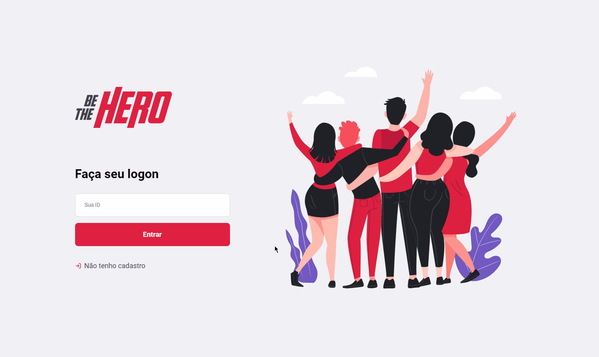
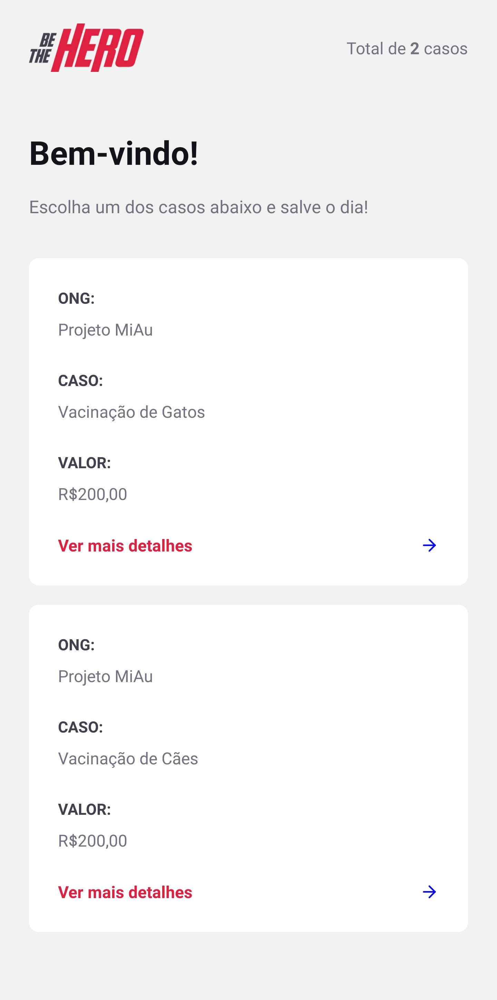
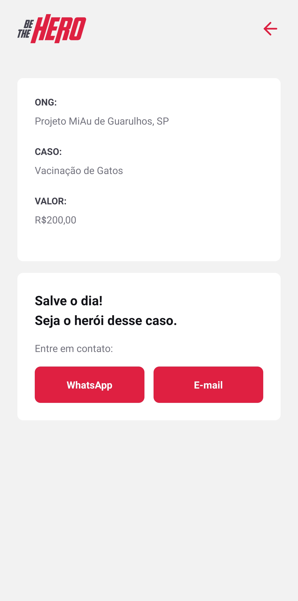

<div align="center">
  
</div>

<br />

# 📚 Table of contents
- <a href="#-layout">Layout</a>
- <a href="#-about-the-project">About the project</a>
- <a href="#-features">Features</a>
- <a href="#-technologies-used">Technologies used</a>
  - <a href="#web-1">Web</a>
  - <a href="#mobile-1">Mobile</a>
  - <a href="#server">Server</a>
- <a href="#-running-the-application">Running the application</a>
  - <a href="#pre-requisites">Pre-requisites</a>
  - <a href="#downloading">Downloading</a>
  - <a href="#adjustments">Adjustments</a>
  - <a href="#running-the-server">Running the server</a>
  - <a href="#running-the-front-end-(web)">Running the front-end (Web)</a>
  - <a href="#running-the-front-end-(mobile)">Running the front-end (Mobile)</a>
- <a href="#-author">Author</a>
- <a href="#-license">License</a>

# 🎨 Layout
<div align="center">
  <h2>Web</h2> 
  
</div>

<div align="center">
  <h2>Mobile</h2> 
  
  
</div>


# 💡 About the project
**Be The Hero** is an application that connects non-governmental organizations that need some financial support to people who are willing to help them.

This is a project developed during the Omnistack week #11 (now as **[Next Level Week](https://nextlevelweek.com/)**), carried out by **[Rocketseat](https://rocketseat.com.br/)**.

<div align="right">
  <a href="#-table-of-contents">Back to top</a>
</div>

# ⚙ Features
NGOs (non-governmental organizations) can register on the web platform by sending:
- Name of the NGO
- Email
- Whatsapp
- City
- FU (Federative Unit)

In addition to register new cases/incidents, the NGOs can provide:
- Case title
- Description
- Value in reais

Users have access to the mobile application, where they can:
- Search for an incident to help
- Contact the NGO via Whatsapp or email

<div align="right">
  <a href="#-table-of-contents">Back to top</a>
</div>

# 🛠 Technologies used
This project was developed using the following technologies:

## Web
- React.js
- Axios
- Polished
- Styled Components
- React Router DOM
- React Icons
- ESLint
- Prettier

## Mobile
- Axios
- Expo
- Expo Mail Composer
- Expo Constants
- Styled Components
- React Navigation

## Server
- Node.js
- Nodemon
- Express
- Knex
- CORS
- SQLite3

<div align="right">
  <a href="#-table-of-contents">Back to top</a>
</div>

# 🚀 Running the application

This project is divided into three parts:

- **Server** (backend folder)
- **Web** (frontend folder)
- **Mobile** (mobile folder)

💡 Both Web and Mobile need the Server to be running to work.

<div align="right">
  <a href="#-table-of-contents">Back to top</a>
</div>

## Pre-requisites

- **[Node.js](https://nodejs.org/en/download/)**

    *Install the LTS version.*

    Required to run JS / TS code on your machine.

- **[Yarn](https://classic.yarnpkg.com/pt-BR/docs/install/#windows-stable)**

    Node.js package manager.

    Used to install the libraries and frameworks used in the application.

    *You can also use NPM, which is installed on your computer when you install Node.js*

- **[Git](https://git-scm.com/downloads)**

    Contains several resources for versioning the code.

    It can also be used to download the application code on your local machine.

<div align="right">
  <a href="#-table-of-contents">Back to top</a>
</div>

## Downloading

Download the application on your machine with the following command on the terminal:

```bash
git clone https://github.com/Eduardo-SO/be-the-hero.git

# or if you have an SSH key configured on github run the command below

git clone git@github.com:Eduardo-SO/be-the-hero.git
```

Once this is done, a folder containing the application code will be downloaded

- Access it:

  ```bash
  cd be-the-hero
  ```

<div align="right">
  <a href="#-table-of-contents">Back to top</a>
</div>

## Adjustments
Before we continue, make sure to change the application's IP to your local machine's IP

You can change them at:
- `mobile\src\services\api.ts`

<div align="right">
  <a href="#-table-of-contents">Back to top</a>
</div>

## Running the server

- Enter the `backend` folder:

  ```bash
  cd backend
  ```

- Install dependencies with Yarn:

  ```bash
  yarn
  ```

- Run the migrations to create the tables in the database:

  ```bash
  yarn knex:migrate
  ```


- Start the server:

  ```bash
  yarn start
  ```

With that the server will be started on the port `3333`

**Open a new terminal** and continue following the steps below

<div align="right">
  <a href="#-table-of-contents">Back to top</a>
</div>

## Running the front-end (Web)

- Open the `frontend` folder:

  ```bash
  cd frontend
  ```

- Install dependencies with Yarn:

  ```bash
  yarn
  ```

- Start the web server:

  ```bash
  yarn start
  ```

With that the server will be started in [http://localhost:3000/](http://localhost:3000/)

**Open a new terminal** and continue following the steps below

<div align="right">
  <a href="#-table-of-contents">Back to top</a>
</div>

## Running the front-end (Mobile)

To start the mobile application you will need a phone with the **Expo** application or an emulator

- Open the `mobile` folder:

  ```bash
  cd ../mobile
  ```

- Install dependencies with Yarn:

  ```bash
  yarn
  ```

- Start the mobile server:

  ```bash
  yarn start
  ```

- Open the expo application on your phone and scan the QR code that will appear

<div align="right">
  <a href="#-table-of-contents">Back to top</a>
</div>

# 👨‍💻 Author

Made with 💜 by [Eduardo Souza de Oliveira](https://github.com/Eduardo-SO)

[](https://www.linkedin.com/in/eduardo-s-242652103/) 
[](mailto:eduardo.sool07@gmail.com)

<div align="right">
  <a href="#-table-of-contents">Back to top</a>
</div>

# 📜 License

This project is under the license MIT.

<div align="right">
  <a href="#-table-of-contents">Back to top</a>
</div>